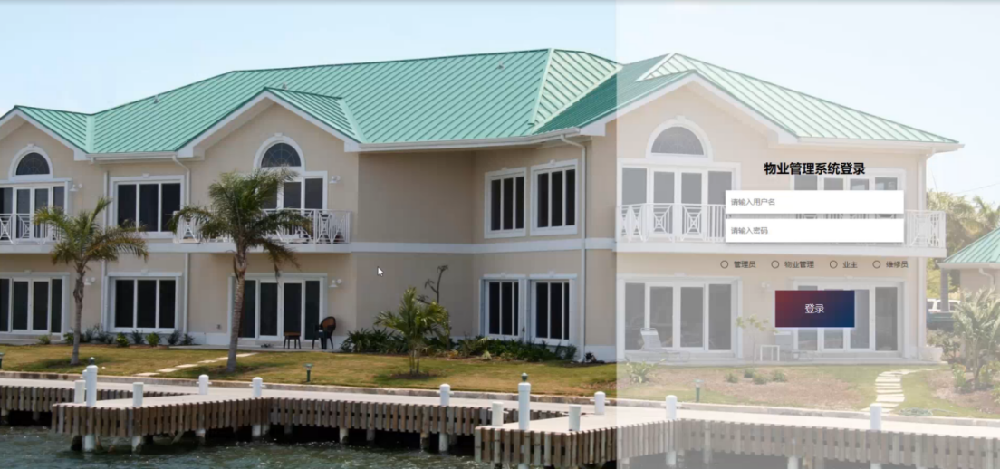
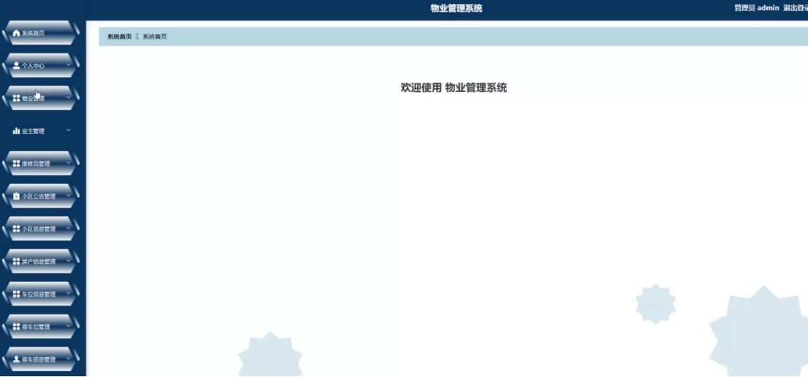
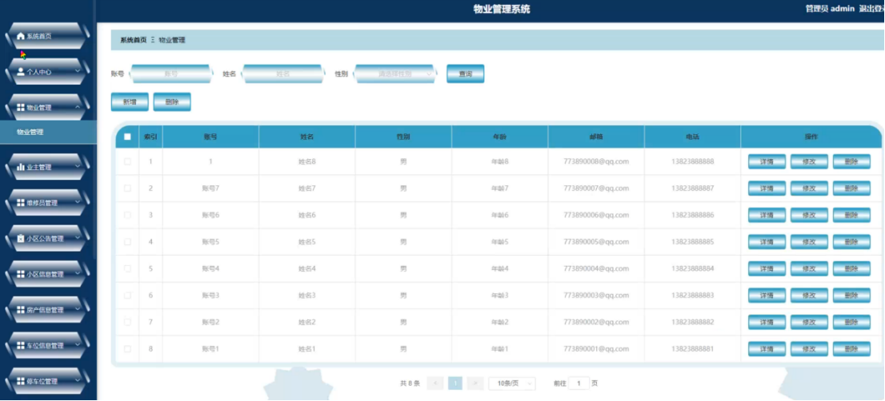
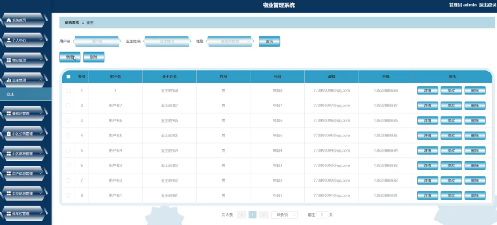
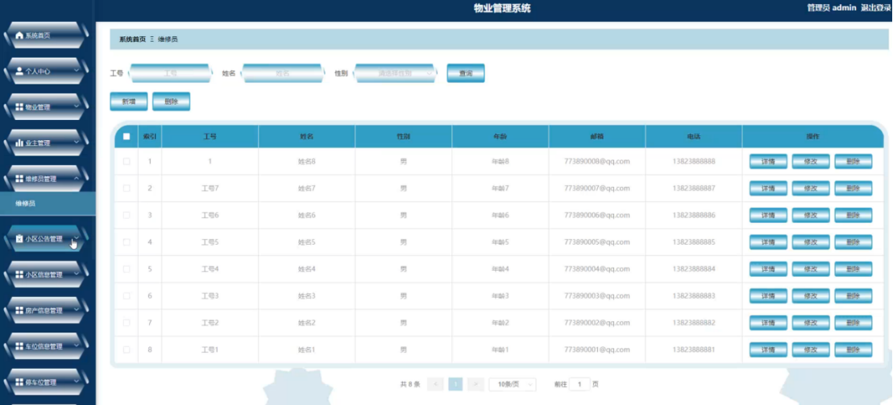
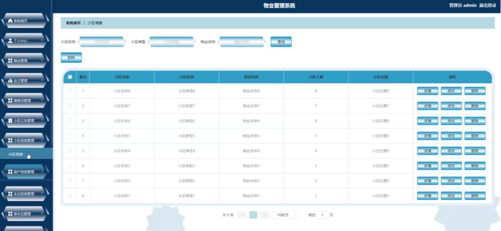
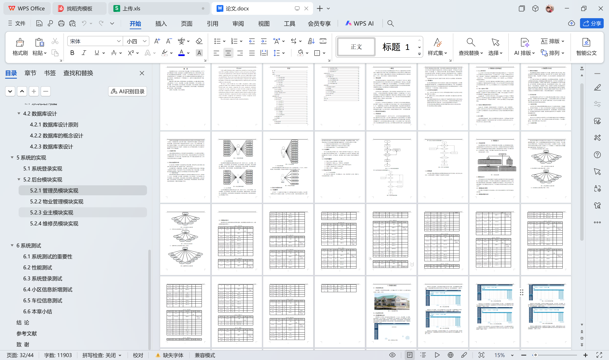

# springboot217-基于SpringBoot的物业管理系统

>  博主介绍：
>  Hey，我是程序员Chaers，一个专注于计算机领域的程序员
>  十年大厂程序员全栈开发‍ 日常分享项目经验 解决技术难题与技术推荐 承接各类网站设计，小程序开发，毕设等。
>  【计算机专业课程设计，毕业设计项目，Java，微信小程序，安卓APP都可以做，不仅仅是计算机专业，其它专业都可以】

## 3000套系统可挑选，获取链接：https://chaerspol.github.io/

<b>QQ【获取完整源码】：674456564</b>

<b>QQ群【获取完整源码】：1058861570</b>

### 系统架构

> 前端：html | js | css | jquery | vue
>
> 后端：springboot | mybatis
> 
> 环境：jdk1.8+ | mysql | maven

# 一、内容包括
包括有  项目源码+项目论文+数据库源码+答辩ppt+远程调试成功

# 二、运行环境

> jdk版本：1.8 及以上； ide工具：IDEA； 数据库: mysql5.7及以上；编程语言: Java

# 三、需求分析

**3.1需求分析概述**

物业管理系统主要是为了提高用户的工作效率，满足用户对更方便、更快、更好地存储所有信息和数据检索功能的要求。通过对多个用户的合理分析，确定了物业管理系统的各个模块。考虑到用户的可操作性，经过深入调查研究，遵循系统优化和开发的原则。
为了实现当前网络的分析功能和便利性，物业管理系统使管理员、物业管理、业主和维修员能够在系统上直接查看他们需要的数据信息，不仅可以节省管理时间，还可以改变传统的管理模式。如果用户想要交换信息，他们需要满足双方交换信息的需要。由于时间有限，很难亲自会面和沟通，因此很难满足用户的需求。因此，迫切需要开发一个物业管理系统，以满足用户的需求，提高用户的使用率。物业管理系统必须更快、更有效地向用户或潜在用户提供信息。为物业管理系统建立更好的沟通系统，提高用户信息交流系统的服务效率。该系统可以满足大多数用户提出的问题，用户可以根据自己的需要获得相应的服务，为物业管理系统提供了一条快捷的途径。

**3.2可行性分析**

物业管理系统研发出来可以为广大人民群众解决物业管理的问题，大大降低人民时间成本，不需要将无谓的时间浪费在道路上，并且物业管理可以更大化的将信息展露在人们的眼前供其选择。它是一款多用户使用的系统，比较符合业务逻辑，是通过互联网解决复杂和单调问题的典型案例。

**3.2.1技术可行性**

技术可行性是分析系统都需要用到哪些技术知识，语法是否规范标准，代码量多大，是否具有可移植性，在 MVC 在这种设计模式下能够真正的实现数据层和表示层的分离[6]，以及前端页面是否可以做到美观实用，是否吸引眼球。系统是否足够稳定，后端管理页面是否足够方便管理，数据库的构建是否可以符合系统要求，是否需要搭建集群等等。

**3.2.2经济可行性**

通过结合以上对系统的技术和可行性分析来判断对系统经济状况的预算是否大于系统开发资金的比例。因此，通过分析系统的业务模式和开发者模式，不会浪费大量资金，系统的使用价值大于资本价值[7]。

**3.2.3运营可行性**

可操作性是指将系统开发所涉及到的所有功能全都实现，是否可以满足大部分用户的需求，页面是否美观，能否让用户满意，代码显示是否为轻量级，操作和功能是否简单便捷，是否同时适用。系统能否同时应用于windows、linux等操作系统，这取决于系统的可移植性。JAVA 编程语言的适应性非常强，基本上能够较好的适应目前市场环境中所流行的各个系统[8]。也就是说JAVA的可移植性很强，那么系统的价值越高，可行性也就越强。

**3.2.4法律可行性**

该物业管理系统是面向大众开源化和不收取任何费用的。它的主要目的是帮助人们解决物业管理问题。完全符合法律可行性要求，系统内部权限划分不会导致内部用户泄露系统机密。对于用户信息，系统有保护措施，用户密码在数据库中加密，并有严格的自我控制和小区价格解释。

# 四、功能模块

物业管理系统分为四个部分，即管理员管理、物业管理、业主管理和维修员管理。该系统是根据用户的实际需求开发的，贴近生活。从管理员处获得的指定账号和密码可用于进入系统和使用相关的系统应用程序。管理员拥有最大的权限，其次是物业管理、业主和维修员。管理员一般负责整个系统的运行维护和总体协调。

# 五、效果图展示【部分效果图】

图5-1 系统登录界面【系统登录，在登录页面选择权限，在正确输入用户名、密码后，进入操作系统进行操作；如图5-1所示】

图5-2管理员主界面【管理员进入主页面，主要功能包括对系统首页、个人中心、物业管理、业主管理、维修员管理、小区公告管理、小区信息管理、房产信息管理、车位信息管理、停车位管理、停车信息管理、缴费信息管理、投诉分类管理、投诉信息管理、投诉处理管理、报修信息管理、维修处理管理、服务评价管理、活动信息管理等进行操作。管理员主界面如图5-2所示】

图5-3物业管理界面【管理员点击物业管理。在物业管理页面输入账号可以查询，新增或删除物业管理列表，并根据需要对物业管理详情信息进行查看详情、修改或删除操作。如图5-3所示】

图5-4业主管理界面【管理员点击业主管理。在业主页面输入用户名可以查询、新增或删除业主列表，并根据需要对业主详情信息进行查看详情、修改或删除操作。如图5-4所示】
 

图5-5维修员管理界面【管理员点击维修员管理。在维修员页面输入工号、姓名和性别可以查询、新增或删除维修员列表，并根据需要对维修员详情信息进行查看详情、修改或删除操作。如图5-5所示】

图5-6小区信息管理界面【管理员点击小区信息管理。在小区信息页面输入小区名称、小区类型和物业名称可以查询或删除小区信息列表，并根据需要对小区信息详情信息进行查看详情、修改或删除操作。如图5-6所示】

 <b>完整文章</b>
 

 

## 3000套系统可挑选，获取链接：https://chaerspol.github.io/

<b>QQ【获取完整源码】：674456564</b>

<b>QQ群【获取完整源码】：1058861570</b>

